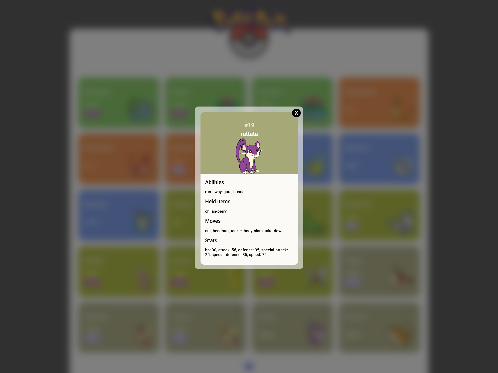

## 📌 Informações gerais

Este projeto é uma **Pokedex interativa** desenvolvida com **HTML, CSS e JavaScript**, que consome a **PokeAPI** para exibir uma lista de Pokémons. Ao clicar em um Pokémon, suas características e alguns detalhes são exibidos.

## 🛠 Tecnologias Utilizadas

- **HTML** (estrutura da aplicação)
- **CSS** (estilização e layout responsivo)
- **JavaScript** (manipulação do DOM e consumo da API)
- **PokeAPI** (fornecimento dos dados dos Pokémons)

## 🚀 Funcionalidades
- **Exibição da Lista de Pokémons**: Mostra os nomes e imagens dos Pokémons.
- **Detalhes do Pokémon**: Ao clicar, exibe suas características mais detalhadamente.
- **Estilização Responsiva**: Interface adaptável para diferentes dispositivos.

## 📌 Exemplo de Uso
1. A página inicial exibe uma lista de Pokémons.
2. Clique em um Pokémon para visualizar seus detalhes.
3. Veja suas características como habilidades, held items, movimentos e stats.

## Imagens

## 🔗 Link de Acesso
### https://github.com/carolinavitorio/Pokedex.git
---